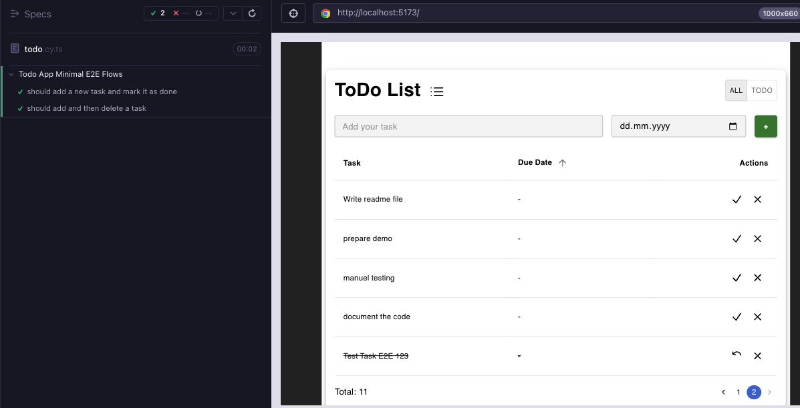

# **ToDo App**

This is a simple and functional full-stack ToDo application built with **ReactJS + TypeScript** on the frontend and **C# + .NET** on the backend.


---

## **Tech Stack**

- **Frontend**: [React (TypeScript)](https://react.dev/), [Vite](https://vitejs.dev/), [Material UI](https://mui.com/)
- **Backend**: [.NET 9.0](https://dotnet.microsoft.com/), SQLite
- **Testing**: [Vitest](https://vitest.dev/) (unit/integration), [Cypress](https://www.cypress.io/) (E2E)
- **Runtime**: Node.js 22

---

## **Features**

- **CRUD Operations**: Add, delete, and toggle task completion.
- **Validation**: Task descriptions must be at least 10 characters.
- **Deadlines**: Overdue tasks are automatically highlighted.
- **Sorting & Filtering**: Sort by description, deadline.
- **Pagination**: Configurable page size (default: 6).
- **Search**: Real-time filtering of tasks.
- **Notifications**: Success/error feedback.
- **Responsive UI**: Styled with Material UI.

---

## **Installation & Run**

### **Backend**

```bash
cd server
dotnet restore
dotnet run
```

### **Frontend**

```bash
cd client
npm install
npm run dev
```

---

## **Testing**

### **Unit & Integration Tests**

```bash
npx vitest run
```

### **E2E Tests**

```bash
npx cypress run
```



## **Linting**

```bash
npx eslint src --ext .ts,.tsx --fix
```
